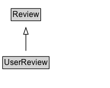

# UserReview

A review created by an end-user (e.g. consumer, purchaser, attendee etc.), in contrast with [[CriticReview]].

## Diagram

=== "SVG (interactive)"

    <!-- Generated by graphviz version 14.1.3 (20260303.0454)
     -->
    <!-- Pages: 1 -->
    <svg width="166pt" height="132pt"
     viewBox="0.00 0.00 166.00 132.00" xmlns="http://www.w3.org/2000/svg" xmlns:xlink="http://www.w3.org/1999/xlink">
    <g id="graph0" class="graph" transform="scale(1 1) rotate(0) translate(4 128)">
    <polygon fill="white" stroke="none" points="-4,4 -4,-128 162,-128 162,4 -4,4"/>
    <g id="clust3" class="cluster">
    <title>cluster_associated</title>
    </g>
    <!-- Review -->
    <g id="node1" class="node">
    <title>Review</title>
    <g id="a_node1"><a xlink:href="../Review" xlink:title="&lt;TABLE&gt;">
    <polygon fill="lightgray" stroke="none" points="13.75,-97.88 13.75,-114.12 56.25,-114.12 56.25,-97.88 13.75,-97.88"/>
    <text xml:space="preserve" text-anchor="start" x="14.75" y="-101.88" font-family="Arial" font-size="12.00">Review</text>
    <polygon fill="none" stroke="black" points="12.75,-96.88 12.75,-115.12 57.25,-115.12 57.25,-96.88 12.75,-96.88"/>
    </a>
    </g>
    </g>
    <!-- UserReview -->
    <g id="node2" class="node">
    <title>UserReview</title>
    <g id="a_node2"><a xlink:href="../UserReview" xlink:title="&lt;TABLE&gt;">
    <polygon fill="lightgray" stroke="none" points="1,-25.88 1,-42.12 69,-42.12 69,-25.88 1,-25.88"/>
    <text xml:space="preserve" text-anchor="start" x="2" y="-29.88" font-family="Arial" font-size="12.00">UserReview</text>
    <polygon fill="none" stroke="black" points="0,-24.88 0,-43.12 70,-43.12 70,-24.88 0,-24.88"/>
    </a>
    </g>
    </g>
    <!-- UserReview&#45;&gt;Review -->
    <g id="edge1" class="edge">
    <title>UserReview&#45;&gt;Review</title>
    <path fill="none" stroke="black" d="M35,-51.79C35,-59.25 35,-68.24 35,-76.69"/>
    <polygon fill="none" stroke="black" points="31.5,-76.54 35,-86.54 38.5,-76.54 31.5,-76.54"/>
    </g>
    <!-- Invis -->
    </g>
    </svg>

=== "PNG"

    

## Formalization for UserReview

| Property | Constraint |
|----------|------------|
| subClassOf | [Review](Review.md) |

