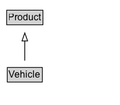

# Vehicle

A vehicle is a device that is designed or used to transport people or cargo over land, water, air, or through space.

## Diagram

=== "SVG (interactive)"

    <!-- Generated by graphviz version 14.1.3 (20260303.0454)
     -->
    <!-- Pages: 1 -->
    <svg width="150pt" height="132pt"
     viewBox="0.00 0.00 150.00 132.00" xmlns="http://www.w3.org/2000/svg" xmlns:xlink="http://www.w3.org/1999/xlink">
    <g id="graph0" class="graph" transform="scale(1 1) rotate(0) translate(4 128)">
    <polygon fill="white" stroke="none" points="-4,4 -4,-128 146,-128 146,4 -4,4"/>
    <g id="clust3" class="cluster">
    <title>cluster_associated</title>
    </g>
    <!-- Product -->
    <g id="node1" class="node">
    <title>Product</title>
    <g id="a_node1"><a xlink:href="../Product" xlink:title="&lt;TABLE&gt;">
    <polygon fill="lightgray" stroke="none" points="5.38,-97.88 5.38,-114.12 48.62,-114.12 48.62,-97.88 5.38,-97.88"/>
    <text xml:space="preserve" text-anchor="start" x="6.38" y="-101.88" font-family="Arial" font-size="12.00">Product</text>
    <polygon fill="none" stroke="black" points="4.38,-96.88 4.38,-115.12 49.62,-115.12 49.62,-96.88 4.38,-96.88"/>
    </a>
    </g>
    </g>
    <!-- Vehicle -->
    <g id="node2" class="node">
    <title>Vehicle</title>
    <g id="a_node2"><a xlink:href="../Vehicle" xlink:title="&lt;TABLE&gt;">
    <polygon fill="lightgray" stroke="none" points="6.12,-25.88 6.12,-42.12 47.88,-42.12 47.88,-25.88 6.12,-25.88"/>
    <text xml:space="preserve" text-anchor="start" x="7.12" y="-29.88" font-family="Arial" font-size="12.00">Vehicle</text>
    <polygon fill="none" stroke="black" points="5.12,-24.88 5.12,-43.12 48.88,-43.12 48.88,-24.88 5.12,-24.88"/>
    </a>
    </g>
    </g>
    <!-- Vehicle&#45;&gt;Product -->
    <g id="edge1" class="edge">
    <title>Vehicle&#45;&gt;Product</title>
    <path fill="none" stroke="black" d="M27,-51.79C27,-59.25 27,-68.24 27,-76.69"/>
    <polygon fill="none" stroke="black" points="23.5,-76.54 27,-86.54 30.5,-76.54 23.5,-76.54"/>
    </g>
    <!-- Invis -->
    </g>
    </svg>

=== "PNG"

    

## Specializations of Vehicle

| Class | Description |
|-------|-------------|
| [Bus Or Coach](BusOrCoach.md) | A bus (also omnibus or autobus) is a road vehicle designed to carry passengers. Coaches are luxury buses, usually in service for long distance travel. |
| [Car](Car.md) | A car is a wheeled, self-powered motor vehicle used for transportation. |
| [Motorcycle](Motorcycle.md) | A motorcycle or motorbike is a single-track, two-wheeled motor vehicle. |
| [Motorized Bicycle](MotorizedBicycle.md) | A motorized bicycle is a bicycle with an attached motor used to power the vehicle, or to assist with pedaling. |

## Formalization for Vehicle

| Property | Constraint |
|----------|------------|
| subClassOf | [Product](Product.md) |

