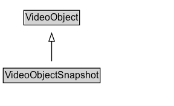

# VideoObjectSnapshot

A specific and exact (byte-for-byte) version of a [[VideoObject]]. Two byte-for-byte identical files, for the purposes of this type, considered identical. If they have different embedded metadata the files will differ. Different external facts about the files, e.g. creator or dateCreated that aren't represented in their actual content, do not affect this notion of identity.

## Diagram

=== "SVG (interactive)"

    <!-- Generated by graphviz version 14.1.3 (20260303.0454)
     -->
    <!-- Pages: 1 -->
    <svg width="216pt" height="132pt"
     viewBox="0.00 0.00 216.00 132.00" xmlns="http://www.w3.org/2000/svg" xmlns:xlink="http://www.w3.org/1999/xlink">
    <g id="graph0" class="graph" transform="scale(1 1) rotate(0) translate(4 128)">
    <polygon fill="white" stroke="none" points="-4,4 -4,-128 212.12,-128 212.12,4 -4,4"/>
    <g id="clust3" class="cluster">
    <title>cluster_associated</title>
    </g>
    <!-- VideoObject -->
    <g id="node1" class="node">
    <title>VideoObject</title>
    <g id="a_node1"><a xlink:href="../VideoObject" xlink:title="&lt;TABLE&gt;">
    <polygon fill="lightgray" stroke="none" points="26.5,-97.88 26.5,-114.12 93.75,-114.12 93.75,-97.88 26.5,-97.88"/>
    <text xml:space="preserve" text-anchor="start" x="27.5" y="-101.88" font-family="Arial" font-size="12.00">VideoObject</text>
    <polygon fill="none" stroke="black" points="25.5,-96.88 25.5,-115.12 94.75,-115.12 94.75,-96.88 25.5,-96.88"/>
    </a>
    </g>
    </g>
    <!-- VideoObjectSnapshot -->
    <g id="node2" class="node">
    <title>VideoObjectSnapshot</title>
    <g id="a_node2"><a xlink:href="../VideoObjectSnapshot" xlink:title="&lt;TABLE&gt;">
    <polygon fill="lightgray" stroke="none" points="1,-25.88 1,-42.12 119.25,-42.12 119.25,-25.88 1,-25.88"/>
    <text xml:space="preserve" text-anchor="start" x="2" y="-29.88" font-family="Arial" font-size="12.00">VideoObjectSnapshot</text>
    <polygon fill="none" stroke="black" points="0,-24.88 0,-43.12 120.25,-43.12 120.25,-24.88 0,-24.88"/>
    </a>
    </g>
    </g>
    <!-- VideoObjectSnapshot&#45;&gt;VideoObject -->
    <g id="edge1" class="edge">
    <title>VideoObjectSnapshot&#45;&gt;VideoObject</title>
    <path fill="none" stroke="black" d="M60.12,-51.79C60.12,-59.25 60.12,-68.24 60.12,-76.69"/>
    <polygon fill="none" stroke="black" points="56.63,-76.54 60.13,-86.54 63.63,-76.54 56.63,-76.54"/>
    </g>
    <!-- Invis -->
    </g>
    </svg>

=== "PNG"

    

## Formalization for VideoObjectSnapshot

| Property | Constraint |
|----------|------------|
| subClassOf | [VideoObject](VideoObject.md) |

