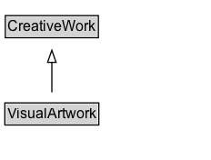

# VisualArtwork

A work of art that is primarily visual in character.

## Diagram

=== "SVG (interactive)"

    <!-- Generated by graphviz version 14.1.3 (20260303.0454)
     -->
    <!-- Pages: 1 -->
    <svg width="174pt" height="132pt"
     viewBox="0.00 0.00 174.00 132.00" xmlns="http://www.w3.org/2000/svg" xmlns:xlink="http://www.w3.org/1999/xlink">
    <g id="graph0" class="graph" transform="scale(1 1) rotate(0) translate(4 128)">
    <polygon fill="white" stroke="none" points="-4,4 -4,-128 169.75,-128 169.75,4 -4,4"/>
    <g id="clust3" class="cluster">
    <title>cluster_associated</title>
    </g>
    <!-- CreativeWork -->
    <g id="node1" class="node">
    <title>CreativeWork</title>
    <g id="a_node1"><a xlink:href="../CreativeWork" xlink:title="&lt;TABLE&gt;">
    <polygon fill="lightgray" stroke="none" points="1.38,-97.88 1.38,-114.12 76.12,-114.12 76.12,-97.88 1.38,-97.88"/>
    <text xml:space="preserve" text-anchor="start" x="2.38" y="-101.88" font-family="Arial" font-size="12.00">CreativeWork</text>
    <polygon fill="none" stroke="black" points="0.38,-96.88 0.38,-115.12 77.12,-115.12 77.12,-96.88 0.38,-96.88"/>
    </a>
    </g>
    </g>
    <!-- VisualArtwork -->
    <g id="node2" class="node">
    <title>VisualArtwork</title>
    <g id="a_node2"><a xlink:href="../VisualArtwork" xlink:title="&lt;TABLE&gt;">
    <polygon fill="lightgray" stroke="none" points="1,-25.88 1,-42.12 76.5,-42.12 76.5,-25.88 1,-25.88"/>
    <text xml:space="preserve" text-anchor="start" x="2" y="-29.88" font-family="Arial" font-size="12.00">VisualArtwork</text>
    <polygon fill="none" stroke="black" points="0,-24.88 0,-43.12 77.5,-43.12 77.5,-24.88 0,-24.88"/>
    </a>
    </g>
    </g>
    <!-- VisualArtwork&#45;&gt;CreativeWork -->
    <g id="edge1" class="edge">
    <title>VisualArtwork&#45;&gt;CreativeWork</title>
    <path fill="none" stroke="black" d="M38.75,-51.79C38.75,-59.25 38.75,-68.24 38.75,-76.69"/>
    <polygon fill="none" stroke="black" points="35.25,-76.54 38.75,-86.54 42.25,-76.54 35.25,-76.54"/>
    </g>
    <!-- Invis -->
    </g>
    </svg>

=== "PNG"

    

## Specializations of VisualArtwork

| Class | Description |
|-------|-------------|
| [Comic Cover Art](ComicCoverArt.md) | The artwork on the cover of a comic. |
| [Cover Art](CoverArt.md) | The artwork on the outer surface of a CreativeWork. |
| [Sequential Art](SequentialArt.md) | An art forms that use images deployed in a specific order for the purpose of graphic storytelling (i.e., narration of graphic stories) or conveying information. Examples of SequentialArt are Franco-Belgian Bande Dessinée, Comics in the USA and 漫画 (Manga) in Japan. |

## Formalization for VisualArtwork

| Property | Constraint |
|----------|------------|
| subClassOf | [CreativeWork](CreativeWork.md) |

