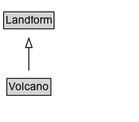

# Volcano

A volcano, like Fujisan.

## Diagram

=== "SVG (interactive)"

    <!-- Generated by graphviz version 14.1.3 (20260303.0454)
     -->
    <!-- Pages: 1 -->
    <svg width="150pt" height="132pt"
     viewBox="0.00 0.00 150.00 132.00" xmlns="http://www.w3.org/2000/svg" xmlns:xlink="http://www.w3.org/1999/xlink">
    <g id="graph0" class="graph" transform="scale(1 1) rotate(0) translate(4 128)">
    <polygon fill="white" stroke="none" points="-4,4 -4,-128 146.12,-128 146.12,4 -4,4"/>
    <g id="clust3" class="cluster">
    <title>cluster_associated</title>
    </g>
    <!-- Landform -->
    <g id="node1" class="node">
    <title>Landform</title>
    <g id="a_node1"><a xlink:href="../Landform" xlink:title="&lt;TABLE&gt;">
    <polygon fill="lightgray" stroke="none" points="1,-97.88 1,-114.12 53.25,-114.12 53.25,-97.88 1,-97.88"/>
    <text xml:space="preserve" text-anchor="start" x="2" y="-101.88" font-family="Arial" font-size="12.00">Landform</text>
    <polygon fill="none" stroke="black" points="0,-96.88 0,-115.12 54.25,-115.12 54.25,-96.88 0,-96.88"/>
    </a>
    </g>
    </g>
    <!-- Volcano -->
    <g id="node2" class="node">
    <title>Volcano</title>
    <g id="a_node2"><a xlink:href="../Volcano" xlink:title="&lt;TABLE&gt;">
    <polygon fill="lightgray" stroke="none" points="4.38,-25.88 4.38,-42.12 49.88,-42.12 49.88,-25.88 4.38,-25.88"/>
    <text xml:space="preserve" text-anchor="start" x="5.38" y="-29.88" font-family="Arial" font-size="12.00">Volcano</text>
    <polygon fill="none" stroke="black" points="3.38,-24.88 3.38,-43.12 50.88,-43.12 50.88,-24.88 3.38,-24.88"/>
    </a>
    </g>
    </g>
    <!-- Volcano&#45;&gt;Landform -->
    <g id="edge1" class="edge">
    <title>Volcano&#45;&gt;Landform</title>
    <path fill="none" stroke="black" d="M27.12,-51.79C27.12,-59.25 27.12,-68.24 27.12,-76.69"/>
    <polygon fill="none" stroke="black" points="23.63,-76.54 27.13,-86.54 30.63,-76.54 23.63,-76.54"/>
    </g>
    <!-- Invis -->
    </g>
    </svg>

=== "PNG"

    

## Formalization for Volcano

| Property | Constraint |
|----------|------------|
| subClassOf | [Landform](Landform.md) |

