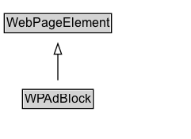

# WPAdBlock

An advertising section of the page.

## Diagram

=== "SVG (interactive)"

    <!-- Generated by graphviz version 14.1.3 (20260303.0454)
     -->
    <!-- Pages: 1 -->
    <svg width="181pt" height="132pt"
     viewBox="0.00 0.00 181.00 132.00" xmlns="http://www.w3.org/2000/svg" xmlns:xlink="http://www.w3.org/1999/xlink">
    <g id="graph0" class="graph" transform="scale(1 1) rotate(0) translate(4 128)">
    <polygon fill="white" stroke="none" points="-4,4 -4,-128 176.75,-128 176.75,4 -4,4"/>
    <g id="clust3" class="cluster">
    <title>cluster_associated</title>
    </g>
    <!-- WebPageElement -->
    <g id="node1" class="node">
    <title>WebPageElement</title>
    <g id="a_node1"><a xlink:href="../WebPageElement" xlink:title="&lt;TABLE&gt;">
    <polygon fill="lightgray" stroke="none" points="1,-97.88 1,-114.12 100.5,-114.12 100.5,-97.88 1,-97.88"/>
    <text xml:space="preserve" text-anchor="start" x="2" y="-101.88" font-family="Arial" font-size="12.00">WebPageElement</text>
    <polygon fill="none" stroke="black" points="0,-96.88 0,-115.12 101.5,-115.12 101.5,-96.88 0,-96.88"/>
    </a>
    </g>
    </g>
    <!-- WPAdBlock -->
    <g id="node2" class="node">
    <title>WPAdBlock</title>
    <g id="a_node2"><a xlink:href="../WPAdBlock" xlink:title="&lt;TABLE&gt;">
    <polygon fill="lightgray" stroke="none" points="18.25,-25.88 18.25,-42.12 83.25,-42.12 83.25,-25.88 18.25,-25.88"/>
    <text xml:space="preserve" text-anchor="start" x="19.25" y="-29.88" font-family="Arial" font-size="12.00">WPAdBlock</text>
    <polygon fill="none" stroke="black" points="17.25,-24.88 17.25,-43.12 84.25,-43.12 84.25,-24.88 17.25,-24.88"/>
    </a>
    </g>
    </g>
    <!-- WPAdBlock&#45;&gt;WebPageElement -->
    <g id="edge1" class="edge">
    <title>WPAdBlock&#45;&gt;WebPageElement</title>
    <path fill="none" stroke="black" d="M50.75,-51.79C50.75,-59.25 50.75,-68.24 50.75,-76.69"/>
    <polygon fill="none" stroke="black" points="47.25,-76.54 50.75,-86.54 54.25,-76.54 47.25,-76.54"/>
    </g>
    <!-- Invis -->
    </g>
    </svg>

=== "PNG"

    

## Formalization for WPAdBlock

| Property | Constraint |
|----------|------------|
| subClassOf | [WebPageElement](WebPageElement.md) |

