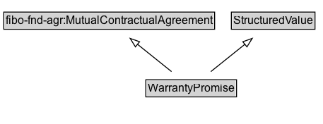

# WarrantyPromise

A structured value representing the duration and scope of services that will be provided to a customer free of charge in case of a defect or malfunction of a product.

## Diagram

=== "SVG (interactive)"

    <!-- Generated by graphviz version 14.1.3 (20260303.0454)
     -->
    <!-- Pages: 1 -->
    <svg width="343pt" height="132pt"
     viewBox="0.00 0.00 343.00 132.00" xmlns="http://www.w3.org/2000/svg" xmlns:xlink="http://www.w3.org/1999/xlink">
    <g id="graph0" class="graph" transform="scale(1 1) rotate(0) translate(4 128)">
    <polygon fill="white" stroke="none" points="-4,4 -4,-128 338.88,-128 338.88,4 -4,4"/>
    <g id="clust3" class="cluster">
    <title>cluster_associated</title>
    </g>
    <!-- fibo&#45;fnd&#45;agr_MutualContractualAgreement -->
    <g id="node1" class="node">
    <title>fibo&#45;fnd&#45;agr_MutualContractualAgreement</title>
    <g id="a_node1"><a xlink:href="https://w3id.org/citydata/imported/fibo-fnd-agr/latest/MutualContractualAgreement" xlink:title="&lt;TABLE&gt;">
    <polygon fill="lightgray" stroke="none" points="1,-97.88 1,-114.12 222.75,-114.12 222.75,-97.88 1,-97.88"/>
    <text xml:space="preserve" text-anchor="start" x="2" y="-101.88" font-family="Arial" font-size="12.00">fibo&#45;fnd&#45;agr:MutualContractualAgreement</text>
    <polygon fill="none" stroke="black" points="0,-96.88 0,-115.12 223.75,-115.12 223.75,-96.88 0,-96.88"/>
    </a>
    </g>
    </g>
    <!-- StructuredValue -->
    <g id="node2" class="node">
    <title>StructuredValue</title>
    <g id="a_node2"><a xlink:href="../StructuredValue" xlink:title="&lt;TABLE&gt;">
    <polygon fill="lightgray" stroke="none" points="242.5,-97.88 242.5,-114.12 329.25,-114.12 329.25,-97.88 242.5,-97.88"/>
    <text xml:space="preserve" text-anchor="start" x="243.5" y="-101.88" font-family="Arial" font-size="12.00">StructuredValue</text>
    <polygon fill="none" stroke="black" points="241.5,-96.88 241.5,-115.12 330.25,-115.12 330.25,-96.88 241.5,-96.88"/>
    </a>
    </g>
    </g>
    <!-- WarrantyPromise -->
    <g id="node3" class="node">
    <title>WarrantyPromise</title>
    <g id="a_node3"><a xlink:href="../WarrantyPromise" xlink:title="&lt;TABLE&gt;">
    <polygon fill="lightgray" stroke="none" points="151.75,-25.88 151.75,-42.12 246,-42.12 246,-25.88 151.75,-25.88"/>
    <text xml:space="preserve" text-anchor="start" x="152.75" y="-29.88" font-family="Arial" font-size="12.00">WarrantyPromise</text>
    <polygon fill="none" stroke="black" points="150.75,-24.88 150.75,-43.12 247,-43.12 247,-24.88 150.75,-24.88"/>
    </a>
    </g>
    </g>
    <!-- WarrantyPromise&#45;&gt;fibo&#45;fnd&#45;agr_MutualContractualAgreement -->
    <g id="edge1" class="edge">
    <title>WarrantyPromise&#45;&gt;fibo&#45;fnd&#45;agr_MutualContractualAgreement</title>
    <path fill="none" stroke="black" d="M178.01,-51.79C167.14,-60.53 153.66,-71.38 141.71,-81"/>
    <polygon fill="none" stroke="black" points="139.71,-78.11 134.11,-87.11 144.1,-83.56 139.71,-78.11"/>
    </g>
    <!-- WarrantyPromise&#45;&gt;StructuredValue -->
    <g id="edge2" class="edge">
    <title>WarrantyPromise&#45;&gt;StructuredValue</title>
    <path fill="none" stroke="black" d="M219.74,-51.79C230.61,-60.53 244.09,-71.38 256.04,-81"/>
    <polygon fill="none" stroke="black" points="253.65,-83.56 263.64,-87.11 258.04,-78.11 253.65,-83.56"/>
    </g>
    <!-- Invis -->
    </g>
    </svg>

=== "PNG"

    

## Formalization for WarrantyPromise

| Property | Constraint |
|----------|------------|
| subClassOf | [StructuredValue](StructuredValue.md) |
| subClassOf | [fibo-fnd-agr:MutualContractualAgreement](https://w3id.org/citydata/imported/fibo-fnd-agr/MutualContractualAgreement) |

