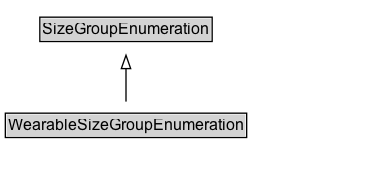

# WearableSizeGroupEnumeration

Enumerates common size groups (also known as "size types") for wearable products.

## Diagram

=== "SVG (interactive)"

    <!-- Generated by graphviz version 14.1.3 (20260303.0454)
     -->
    <!-- Pages: 1 -->
    <svg width="278pt" height="132pt"
     viewBox="0.00 0.00 278.00 132.00" xmlns="http://www.w3.org/2000/svg" xmlns:xlink="http://www.w3.org/1999/xlink">
    <g id="graph0" class="graph" transform="scale(1 1) rotate(0) translate(4 128)">
    <polygon fill="white" stroke="none" points="-4,4 -4,-128 273.5,-128 273.5,4 -4,4"/>
    <g id="clust3" class="cluster">
    <title>cluster_associated</title>
    </g>
    <!-- SizeGroupEnumeration -->
    <g id="node1" class="node">
    <title>SizeGroupEnumeration</title>
    <g id="a_node1"><a xlink:href="../SizeGroupEnumeration" xlink:title="&lt;TABLE&gt;">
    <polygon fill="lightgray" stroke="none" points="26.88,-97.88 26.88,-114.12 154.12,-114.12 154.12,-97.88 26.88,-97.88"/>
    <text xml:space="preserve" text-anchor="start" x="27.88" y="-101.88" font-family="Arial" font-size="12.00">SizeGroupEnumeration</text>
    <polygon fill="none" stroke="black" points="25.88,-96.88 25.88,-115.12 155.12,-115.12 155.12,-96.88 25.88,-96.88"/>
    </a>
    </g>
    </g>
    <!-- WearableSizeGroupEnumeration -->
    <g id="node2" class="node">
    <title>WearableSizeGroupEnumeration</title>
    <g id="a_node2"><a xlink:href="../WearableSizeGroupEnumeration" xlink:title="&lt;TABLE&gt;">
    <polygon fill="lightgray" stroke="none" points="1,-25.88 1,-42.12 180,-42.12 180,-25.88 1,-25.88"/>
    <text xml:space="preserve" text-anchor="start" x="2" y="-29.88" font-family="Arial" font-size="12.00">WearableSizeGroupEnumeration</text>
    <polygon fill="none" stroke="black" points="0,-24.88 0,-43.12 181,-43.12 181,-24.88 0,-24.88"/>
    </a>
    </g>
    </g>
    <!-- WearableSizeGroupEnumeration&#45;&gt;SizeGroupEnumeration -->
    <g id="edge1" class="edge">
    <title>WearableSizeGroupEnumeration&#45;&gt;SizeGroupEnumeration</title>
    <path fill="none" stroke="black" d="M90.5,-51.79C90.5,-59.25 90.5,-68.24 90.5,-76.69"/>
    <polygon fill="none" stroke="black" points="87,-76.54 90.5,-86.54 94,-76.54 87,-76.54"/>
    </g>
    <!-- Invis -->
    </g>
    </svg>

=== "PNG"

    

## Formalization for WearableSizeGroupEnumeration

| Property | Constraint |
|----------|------------|
| subClassOf | [SizeGroupEnumeration](SizeGroupEnumeration.md) |

