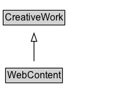

# WebContent

WebContent is a type representing all [[WebPage]], [[WebSite]] and [[WebPageElement]] content. It is sometimes the case that detailed distinctions between Web pages, sites and their parts are not always important or obvious. The  [[WebContent]] type makes it easier to describe Web-addressable content without requiring such distinctions to always be stated. (The intent is that the existing types [[WebPage]], [[WebSite]] and [[WebPageElement]] will eventually be declared as subtypes of [[WebContent]].)

## Diagram

=== "SVG (interactive)"

    <!-- Generated by graphviz version 14.1.3 (20260303.0454)
     -->
    <!-- Pages: 1 -->
    <svg width="169pt" height="132pt"
     viewBox="0.00 0.00 169.00 132.00" xmlns="http://www.w3.org/2000/svg" xmlns:xlink="http://www.w3.org/1999/xlink">
    <g id="graph0" class="graph" transform="scale(1 1) rotate(0) translate(4 128)">
    <polygon fill="white" stroke="none" points="-4,4 -4,-128 165.38,-128 165.38,4 -4,4"/>
    <g id="clust3" class="cluster">
    <title>cluster_associated</title>
    </g>
    <!-- CreativeWork -->
    <g id="node1" class="node">
    <title>CreativeWork</title>
    <g id="a_node1"><a xlink:href="../CreativeWork" xlink:title="&lt;TABLE&gt;">
    <polygon fill="lightgray" stroke="none" points="1,-97.88 1,-114.12 75.75,-114.12 75.75,-97.88 1,-97.88"/>
    <text xml:space="preserve" text-anchor="start" x="2" y="-101.88" font-family="Arial" font-size="12.00">CreativeWork</text>
    <polygon fill="none" stroke="black" points="0,-96.88 0,-115.12 76.75,-115.12 76.75,-96.88 0,-96.88"/>
    </a>
    </g>
    </g>
    <!-- WebContent -->
    <g id="node2" class="node">
    <title>WebContent</title>
    <g id="a_node2"><a xlink:href="../WebContent" xlink:title="&lt;TABLE&gt;">
    <polygon fill="lightgray" stroke="none" points="4,-25.88 4,-42.12 72.75,-42.12 72.75,-25.88 4,-25.88"/>
    <text xml:space="preserve" text-anchor="start" x="5" y="-29.88" font-family="Arial" font-size="12.00">WebContent</text>
    <polygon fill="none" stroke="black" points="3,-24.88 3,-43.12 73.75,-43.12 73.75,-24.88 3,-24.88"/>
    </a>
    </g>
    </g>
    <!-- WebContent&#45;&gt;CreativeWork -->
    <g id="edge1" class="edge">
    <title>WebContent&#45;&gt;CreativeWork</title>
    <path fill="none" stroke="black" d="M38.38,-51.79C38.38,-59.25 38.38,-68.24 38.38,-76.69"/>
    <polygon fill="none" stroke="black" points="34.88,-76.54 38.38,-86.54 41.88,-76.54 34.88,-76.54"/>
    </g>
    <!-- Invis -->
    </g>
    </svg>

=== "PNG"

    

## Specializations of WebContent

| Class | Description |
|-------|-------------|
| [Health Topic Content](HealthTopicContent.md) | [[HealthTopicContent]] is [[WebContent]] that is about some aspect of a health topic, e.g. a condition, its symptoms or treatments. Such content may be comprised of several parts or sections and use different types of media. Multiple instances of [[WebContent]] (and hence [[HealthTopicContent]]) can be related using [[hasPart]] / [[isPartOf]] where there is some kind of content hierarchy, and their content described with [[about]] and [[mentions]] e.g. building upon the existing [[MedicalCondition]] vocabulary.
   |

## Formalization for WebContent

| Property | Constraint |
|----------|------------|
| subClassOf | [CreativeWork](CreativeWork.md) |

