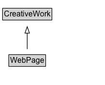

# WebPage

A web page. Every web page is implicitly assumed to be declared to be of type WebPage, so the various properties about that webpage, such as <code>breadcrumb</code> may be used. We recommend explicit declaration if these properties are specified, but if they are found outside of an itemscope, they will be assumed to be about the page.

## Diagram

=== "SVG (interactive)"

    <!-- Generated by graphviz version 14.1.3 (20260303.0454)
     -->
    <!-- Pages: 1 -->
    <svg width="163pt" height="132pt"
     viewBox="0.00 0.00 163.00 132.00" xmlns="http://www.w3.org/2000/svg" xmlns:xlink="http://www.w3.org/1999/xlink">
    <g id="graph0" class="graph" transform="scale(1 1) rotate(0) translate(4 128)">
    <polygon fill="white" stroke="none" points="-4,4 -4,-128 159.38,-128 159.38,4 -4,4"/>
    <g id="clust3" class="cluster">
    <title>cluster_associated</title>
    </g>
    <!-- CreativeWork -->
    <g id="node1" class="node">
    <title>CreativeWork</title>
    <g id="a_node1"><a xlink:href="../CreativeWork" xlink:title="&lt;TABLE&gt;">
    <polygon fill="lightgray" stroke="none" points="1,-97.88 1,-114.12 75.75,-114.12 75.75,-97.88 1,-97.88"/>
    <text xml:space="preserve" text-anchor="start" x="2" y="-101.88" font-family="Arial" font-size="12.00">CreativeWork</text>
    <polygon fill="none" stroke="black" points="0,-96.88 0,-115.12 76.75,-115.12 76.75,-96.88 0,-96.88"/>
    </a>
    </g>
    </g>
    <!-- WebPage -->
    <g id="node2" class="node">
    <title>WebPage</title>
    <g id="a_node2"><a xlink:href="../WebPage" xlink:title="&lt;TABLE&gt;">
    <polygon fill="lightgray" stroke="none" points="10.75,-25.88 10.75,-42.12 66,-42.12 66,-25.88 10.75,-25.88"/>
    <text xml:space="preserve" text-anchor="start" x="11.75" y="-29.88" font-family="Arial" font-size="12.00">WebPage</text>
    <polygon fill="none" stroke="black" points="9.75,-24.88 9.75,-43.12 67,-43.12 67,-24.88 9.75,-24.88"/>
    </a>
    </g>
    </g>
    <!-- WebPage&#45;&gt;CreativeWork -->
    <g id="edge1" class="edge">
    <title>WebPage&#45;&gt;CreativeWork</title>
    <path fill="none" stroke="black" d="M38.38,-51.79C38.38,-59.25 38.38,-68.24 38.38,-76.69"/>
    <polygon fill="none" stroke="black" points="34.88,-76.54 38.38,-86.54 41.88,-76.54 34.88,-76.54"/>
    </g>
    <!-- Invis -->
    </g>
    </svg>

=== "PNG"

    

## Specializations of WebPage

| Class | Description |
|-------|-------------|
| [About Page](AboutPage.md) | Web page type: About page. |
| [Checkout Page](CheckoutPage.md) | Web page type: Checkout page. |
| [Collection Page](CollectionPage.md) | Web page type: Collection page. |
| [Contact Page](ContactPage.md) | Web page type: Contact page. |
| [Faq Page](FAQPage.md) | A [[FAQPage]] is a [[WebPage]] presenting one or more "[Frequently asked questions](https://en.wikipedia.org/wiki/FAQ)" (see also [[QAPage]]). |
| [Image Gallery](ImageGallery.md) | Web page type: Image gallery page. |
| [Item Page](ItemPage.md) | A page devoted to a single item, such as a particular product or hotel. |
| [Media Gallery](MediaGallery.md) | Web page type: Media gallery page. A mixed-media page that can contain media such as images, videos, and other multimedia. |
| [Medical Web Page](MedicalWebPage.md) | A web page that provides medical information. |
| [Profile Page](ProfilePage.md) | Web page type: Profile page. |
| [Qa Page](QAPage.md) | A QAPage is a WebPage focussed on a specific Question and its Answer(s), e.g. in a question answering site or documenting Frequently Asked Questions (FAQs). |
| [Real Estate Listing](RealEstateListing.md) | A [[RealEstateListing]] is a listing that describes one or more real-estate [[Offer]]s (whose [[businessFunction]] is typically to lease out, or to sell).
  The [[RealEstateListing]] type itself represents the overall listing, as manifested in some [[WebPage]].
   |
| [Search Results Page](SearchResultsPage.md) | Web page type: Search results page. |
| [Video Gallery](VideoGallery.md) | Web page type: Video gallery page. |

## Formalization for WebPage

| Property | Constraint |
|----------|------------|
| subClassOf | [CreativeWork](CreativeWork.md) |

