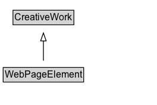

# WebPageElement

A web page element, like a table or an image.

## Diagram

=== "SVG (interactive)"

    <!-- Generated by graphviz version 14.1.3 (20260303.0454)
     -->
    <!-- Pages: 1 -->
    <svg width="198pt" height="132pt"
     viewBox="0.00 0.00 198.00 132.00" xmlns="http://www.w3.org/2000/svg" xmlns:xlink="http://www.w3.org/1999/xlink">
    <g id="graph0" class="graph" transform="scale(1 1) rotate(0) translate(4 128)">
    <polygon fill="white" stroke="none" points="-4,4 -4,-128 193.75,-128 193.75,4 -4,4"/>
    <g id="clust3" class="cluster">
    <title>cluster_associated</title>
    </g>
    <!-- CreativeWork -->
    <g id="node1" class="node">
    <title>CreativeWork</title>
    <g id="a_node1"><a xlink:href="../CreativeWork" xlink:title="&lt;TABLE&gt;">
    <polygon fill="lightgray" stroke="none" points="13.38,-97.88 13.38,-114.12 88.12,-114.12 88.12,-97.88 13.38,-97.88"/>
    <text xml:space="preserve" text-anchor="start" x="14.38" y="-101.88" font-family="Arial" font-size="12.00">CreativeWork</text>
    <polygon fill="none" stroke="black" points="12.38,-96.88 12.38,-115.12 89.12,-115.12 89.12,-96.88 12.38,-96.88"/>
    </a>
    </g>
    </g>
    <!-- WebPageElement -->
    <g id="node2" class="node">
    <title>WebPageElement</title>
    <g id="a_node2"><a xlink:href="../WebPageElement" xlink:title="&lt;TABLE&gt;">
    <polygon fill="lightgray" stroke="none" points="1,-25.88 1,-42.12 100.5,-42.12 100.5,-25.88 1,-25.88"/>
    <text xml:space="preserve" text-anchor="start" x="2" y="-29.88" font-family="Arial" font-size="12.00">WebPageElement</text>
    <polygon fill="none" stroke="black" points="0,-24.88 0,-43.12 101.5,-43.12 101.5,-24.88 0,-24.88"/>
    </a>
    </g>
    </g>
    <!-- WebPageElement&#45;&gt;CreativeWork -->
    <g id="edge1" class="edge">
    <title>WebPageElement&#45;&gt;CreativeWork</title>
    <path fill="none" stroke="black" d="M50.75,-51.79C50.75,-59.25 50.75,-68.24 50.75,-76.69"/>
    <polygon fill="none" stroke="black" points="47.25,-76.54 50.75,-86.54 54.25,-76.54 47.25,-76.54"/>
    </g>
    <!-- Invis -->
    </g>
    </svg>

=== "PNG"

    

## Specializations of WebPageElement

| Class | Description |
|-------|-------------|
| [Site Navigation Element](SiteNavigationElement.md) | A navigation element of the page. |
| [Table](Table.md) | A table on a Web page. |
| [Wp Ad Block](WPAdBlock.md) | An advertising section of the page. |
| [Wp Footer](WPFooter.md) | The footer section of the page. |
| [Wp Header](WPHeader.md) | The header section of the page. |
| [Wp Side Bar](WPSideBar.md) | A sidebar section of the page. |

## Formalization for WebPageElement

| Property | Constraint |
|----------|------------|
| subClassOf | [CreativeWork](CreativeWork.md) |

