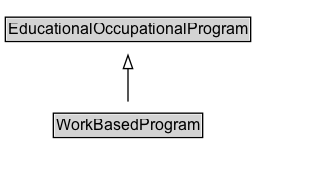

# WorkBasedProgram

A program with both an educational and employment component. Typically based at a workplace and structured around work-based learning, with the aim of instilling competencies related to an occupation. WorkBasedProgram is used to distinguish programs such as apprenticeships from school, college or other classroom based educational programs.

## Diagram

=== "SVG (interactive)"

    <!-- Generated by graphviz version 14.1.3 (20260303.0454)
     -->
    <!-- Pages: 1 -->
    <svg width="244pt" height="132pt"
     viewBox="0.00 0.00 244.00 132.00" xmlns="http://www.w3.org/2000/svg" xmlns:xlink="http://www.w3.org/1999/xlink">
    <g id="graph0" class="graph" transform="scale(1 1) rotate(0) translate(4 128)">
    <polygon fill="white" stroke="none" points="-4,4 -4,-128 240,-128 240,4 -4,4"/>
    <g id="clust3" class="cluster">
    <title>cluster_associated</title>
    </g>
    <!-- EducationalOccupationalProgram -->
    <g id="node1" class="node">
    <title>EducationalOccupationalProgram</title>
    <g id="a_node1"><a xlink:href="../EducationalOccupationalProgram" xlink:title="&lt;TABLE&gt;">
    <polygon fill="lightgray" stroke="none" points="1,-97.88 1,-114.12 183,-114.12 183,-97.88 1,-97.88"/>
    <text xml:space="preserve" text-anchor="start" x="2" y="-101.88" font-family="Arial" font-size="12.00">EducationalOccupationalProgram</text>
    <polygon fill="none" stroke="black" points="0,-96.88 0,-115.12 184,-115.12 184,-96.88 0,-96.88"/>
    </a>
    </g>
    </g>
    <!-- WorkBasedProgram -->
    <g id="node2" class="node">
    <title>WorkBasedProgram</title>
    <g id="a_node2"><a xlink:href="../WorkBasedProgram" xlink:title="&lt;TABLE&gt;">
    <polygon fill="lightgray" stroke="none" points="37,-25.88 37,-42.12 147,-42.12 147,-25.88 37,-25.88"/>
    <text xml:space="preserve" text-anchor="start" x="38" y="-29.88" font-family="Arial" font-size="12.00">WorkBasedProgram</text>
    <polygon fill="none" stroke="black" points="36,-24.88 36,-43.12 148,-43.12 148,-24.88 36,-24.88"/>
    </a>
    </g>
    </g>
    <!-- WorkBasedProgram&#45;&gt;EducationalOccupationalProgram -->
    <g id="edge1" class="edge">
    <title>WorkBasedProgram&#45;&gt;EducationalOccupationalProgram</title>
    <path fill="none" stroke="black" d="M92,-51.79C92,-59.25 92,-68.24 92,-76.69"/>
    <polygon fill="none" stroke="black" points="88.5,-76.54 92,-86.54 95.5,-76.54 88.5,-76.54"/>
    </g>
    <!-- Invis -->
    </g>
    </svg>

=== "PNG"

    

## Formalization for WorkBasedProgram

| Property | Constraint |
|----------|------------|
| subClassOf | [EducationalOccupationalProgram](EducationalOccupationalProgram.md) |

